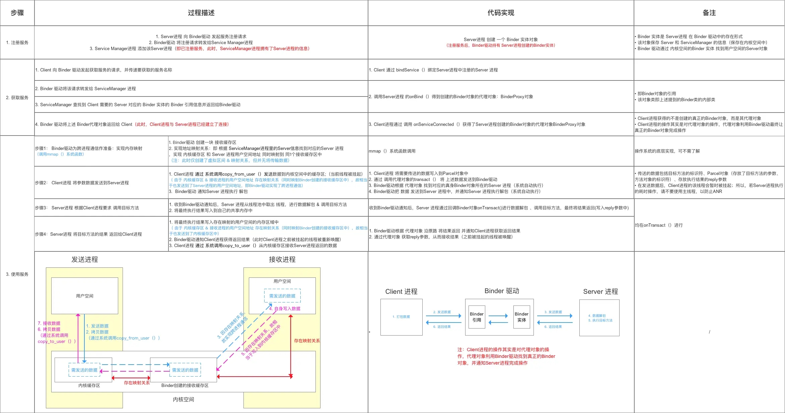

## AIDL使用和Binder机制

[参考](https://blog.csdn.net/github_37130188/article/details/89857282)
[参考](https://www.jianshu.com/p/b5cc1ef9f917)
    
    Binder是一种IPC（进程间通信，Inter-Process Communication）方式，也是一种RPC（远程过程调用，Remote Procedure Call）方式
    是一种实现android跨进程通讯的方式，有物理上的虚拟物理设备驱动，和Binder类组成
    简单来说就是在Client端调用Server端的方法，并返回执行结果给Client
    Server端可使用回调接口的形式调用Client端的方法（实现双向通信）

#### 关键类和方法
    
    从实现的角度来说，Binder核心被实现成一个Linux驱动程序，并运行于内核态。这样它才能具有强大的跨进程访问能力
    
    关键类和接口：IInterface、IBinder、Binder
    关键生成类：
        Stub、Proxy（Server实例化Stub并返回给Client代理，Proxy是Stub的代理）
        Stub实现了IInterface、Binder，Proxy仅实现了IInterface，Proxy返回的Binder是Stub实例
    Server端实例化Stub对象，Client端得到Proxy实例（内部持有Stub），即Proxy为远程Stub在本地（Client）的代理
    
    关键方法：
        IInterface：
            asBinder()：
                在Stub和Proxy中都返回的是Stub实例
        IBinder、Binder：
            transact(int code, Parcel data, Parcel reply, int flags)：
                对对象执行泛型操作
                默认实现回滚Parcel并调用onTransact。在远程端，transact调用binder来执行IPC
                内部调用下面的onTransact（Binder独有的方法）
            onTransact(int code, Parcel data, Parcel reply, int flags)：
                Binder的方法，非IBinder接口，Stub实现此方法
                在Client执行Server端的方法时由Proxy调用Stub的transact方法，传入对应方法的code，
                    然后Stub的transact会调用onTransact，根据code最终会执行对应的方法
                默认实现是一个返回false的Stub。您将希望覆盖此操作以对事务进行适当的反编组。
                如果要调用它，请调用transact()
                返回结果的实现通常应该使用Parcel.writeNoException和Parcel.writeException将异常传播回调用方
                code：
                    要执行的动作。应该是FIRST_CALL_TRANSACTION和LAST_CALL_TRANSACTION之间的数字
                data：
                    编组从调用方接收到的编组数据
                reply：
                    如果调用方期望返回结果，则应将其整理到此处
                flags：
                    附加操作标志。对于普通RPC，为0；对于单向RPC，为FLAG_ONEWAY
                    FLAG_ONEWAY：
                        这是单向呼叫，这意味着调用者立即返回，而无需等待被呼叫者的结果。 
                        仅在主叫方和被叫方处于不同进程中时适用。
                        系统为对同一IBinder对象的多个单向调用提供了特殊的排序语义：
                        这些调用将一次在另一个进程中分派，其顺序与原始调用相同。
                        这些仍然由IPC线程池分派，因此可以在不同的线程上执行，但是直到前一个线程完成后才分派下一个线程。
                        对于不同IBinder对象上的调用，或在同一IBinder对象上混合单向和非单向调用时，不能保证此排序
                返回值：
                    调用成功返回true；返回false通常用于表示不了解code（code不匹配）
            linkToDeath(DeathRecipient recipient, int flags)：
                如果此binder消失，则为通知注册recipient。如果这个binder对象意外消失(通常是因为它的托管进程被终止)，
                则将调用给定的IBinder.DeathRecipient的DeathRecipient.binderDied()方法。
                你只会收到远程binder的死亡通知，因为根据定义，本地binder在没有你的情况下是不会死亡的。
                本地实现是无操作的
            unlinkToDeath(DeathRecipient recipient, int flags)：
                删除先前登记的死亡通知。如果此对象死亡，将不再调用recipient
                返回值：
                    如果目标IBinder已经死亡，则返回false，这意味着该方法已被（或即将被调用）。
                    如果recipient已成功断开链接，则为true，并向您保证不会调用其DeathRecipient.binderDied()方法;
                    如果目标IBinder已经死亡，则为false，这意味着该方法已经（或即将）被调用。
                异常 NoSuchElementException：
                    如果给定的recipient没有在IBinder中注册，并且IBinder仍然存在，则抛异常。
                    请注意，如果recipient从未注册，但是IBinder已经死亡，则不会抛出此异常，而您将收到一个false返回值。
                    本地实现是无操作的
            queryLocalInterface(String descriptor)：
                尝试检索此Binder对象的接口的本地实现。
                如果返回null，则需要实例化一个Proxy类，以通过transact()方法来安排调用
            attachInterface(IInterface owner, String descriptor)：
                Binder的独有方法
                queryLocalInterface查找的本地实现就是由此方法传入的owner，在Stub的构造方法中有调用。
                将特定接口与Binder相关联的便捷方法。调用之后，将为您实现queryLocalInterface()，
                以便在请求相应的描述符时返回给定的 owner IInterface。
        Stub：
            asInterface(IBinder)：
                是由AIDL自动生成的静态方法
                将一个IBinder对象转换到xx.ITransportManager接口（AIDL中定义的接口），如果需要会生成代理对象（Proxy）
                返回的是Proxy实例
                
#### Binder机制
    
 