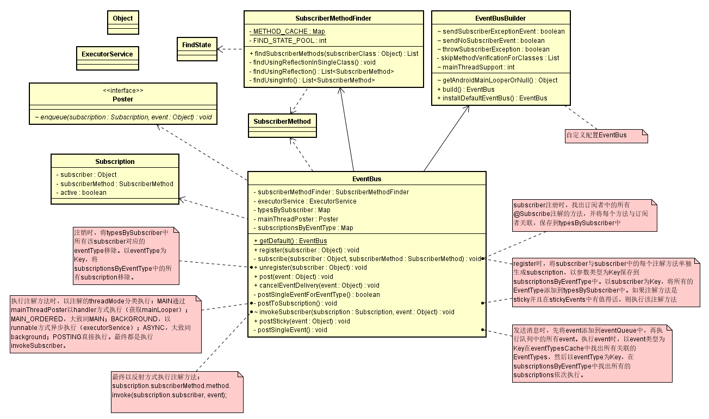

## EventBus事件传递流程分析

UML类图
  
 整个请求流程中涉及到的主要类如上图。
 
 * 注册： 
    subscriber注册时，找出订阅者中的所有@Subscribe注解的方法，并将每个方法与订阅者关联，
    保存到typesBySubscriber中。
    
    register时，将subscriber与subscriber中的每个注解方法单独生成subscription，以参数类型为Key
    保存到subscriptionsByEventType中。以subscriber为Key，将所有的EventType添加到typesBySubscriber中。
    如果注解方法是sticky并且在stickyEvents中有值得话，则执行该注解方法。
    
 * 发送消息： 
    发送消息时，先将event添加到eventQueue中，再执行队列中的所有event。执行event时，
    以event类型为Key在eventTypesCache中找出所有关联的EventTypes，然后以eventType为Key，
    在subscriptionsByEventType中找出所有的subscriptions依次执行。
    
    执行注解方法时（postToSubscription方法），以注解的threadMode分类执行：
    1. MAIN通过mainThreadPoster以handler方式执行（获取mainLooper）； 
    2. MAIN_ORDERED，大致同MAIN； 
    3. BACKGROUND，以runnable方式异步执行（executorService）； 
    4. ASYNC，大致同background； 
    5. POSTING直接执行。
    
    最终都是执行invokeSubscriber。
    最终以反射方式执行注解方法：
    > subscription.subscriberMethod.method.invoke(subscription.subscriber, event);
    
 * 注销： 
    注销时，将typesBySubscriber中所有该subscriber对应的eventType移除。
    以eventType为Key，将subscriptionsByEventType中的所有subscription移除。
 
 * postSticky的使用： 
    在postSticky方法中，首先将event加入到stickyEvents中，然后调用post方法。
    stickyEvents类型为Map<Class<?>, Object>，其key为event.getClass()（event类型），value为event，
    每次以postStick方式发送event时，都会把event加入到这个map中，而map保证了只会保存一份以event类型为key的event，
    所以在此要注意使用postSticky时的一些潜在问题，比如：两个订阅者使用同一种类型的event，而其要求event来自两个不同的事件源时，使用postSticky可能会发生event覆盖现象，订阅者可能会执行不是目标来源的event
    具体使用：
        首先，订阅者event事件处理方法的方法注解上要设置sticky为true
        然后，使用postSticky方式发送event，以post方式发送event时，sticky功能不会生效（因为没有把event缓存到stickyEvents中）
    每次要使用sticky功能的订阅者注册时，都会执行最近一次保存在stickyEvents中的event，此即为sticky功能（具体见subscribe方法）
    