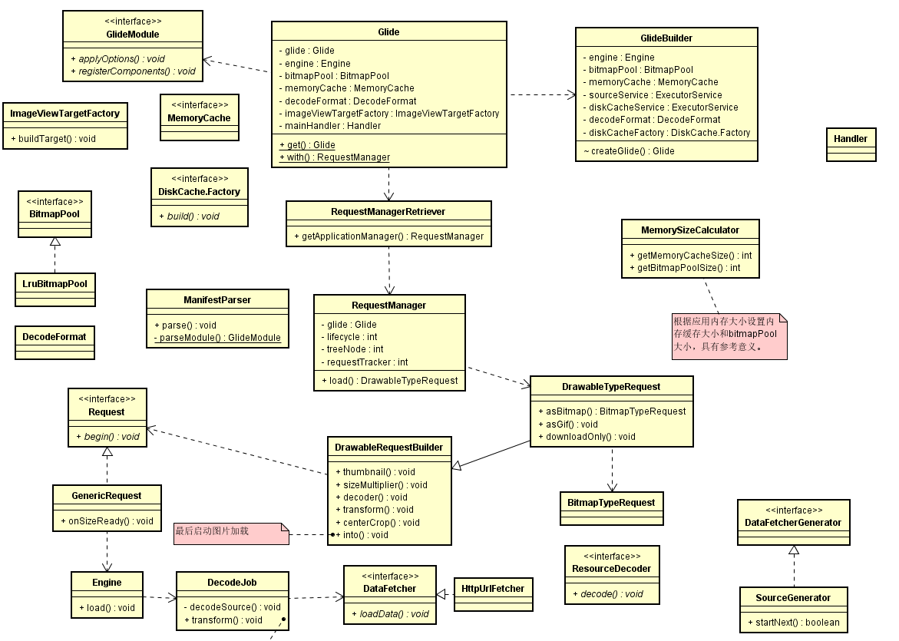

## Glide框架分析

[参考资料](https://www.jianshu.com/p/9bb50924d42a)
[缓存分析](https://www.jianshu.com/p/62b7f990ee83)

    计算缓存大小的类：MemorySizeCalculator
        低内存设备的判断：在android 4.4及以上时使用activityManager.isLowRamDevice() 
        可用的最大内存计算：
            activityManager.getMemoryClass()返回应用最大内存，16MB（Java堆大小），或24MB或更大（大内存设备上）
            Glide可用的最大内存是，应用最大内存 * 0.4（或0.33，小内存设备），0.4、0.33是默认值，可更改
            maxSize = activityManager.getMemoryClass() * 0.4（或0.33）
        ArrayPool：与LRU有关，数组池默认大小4MB，低内存设备上是2MB（4/LOW_MEMORY_BYTE_ARRAY_POOL_DIVISOR）
            availableSize = maxSize - arrayPoolSize，bitmapPool和MemoryCache都从available中分配
            screenSize = widthPixels * heightPixels * BYTES_PER_ARGB_8888_PIXEL（4字节）    
        BitmapPool：
            在android 10及以上，使用硬件渲染？所以BitmapPool不再重要，所需大小更小
            bitmapPoolSize = screenSize * bitmapPoolScreens（默认4或者1，android 10+是1）
        MemoryCache：memoryCacheSize = screenSize * memoryCacheScreens（默认为2）
            bitmapPoolSize + memoryCacheSize <= availableSize时，缓存大小即为上面计算的值
            大于availableSize时，part = availableSize / bitmapPoolScreens + memoryCacheScreens，
                bitmapPoolSize = part*bitmapPoolScreens，memoryCacheSize = part*memoryCacheScreens
    
    DiskCache：磁盘缓存，默认大小250MB，缓存文件夹是image_manager_disk_cache，实现类是InternalCacheDiskCacheFactory生产的DiskLruCacheWrapper，GlideExecutor.newDiskCacheExecutor（线程池）
    LruBitmapPool：位图池实现类
    LruArrayPool：数组池的实现类
    LruResourceCache：内存缓存的实现类（MemoryCache）
    
    处理设置选项，发起加载请求的类：RequestBuilder
        into方法：发起加载请求，其他都是配置选项，由requestManager.track(target, request)发起请求
    实际管理图片加载（生命周期等）的类：SingleRequest
        begin方法：启动异步加载，内部调用 onSizeReady 启动加载
        onSizeReady：不能直接调用，是一个回调方法，当确定target（一般是ImageView）的宽高后触发，再调用engine.load 发起加载请求
        onResourceReady：请求到资源（图片）后触发的回调函数，执行其他的回调，如：target.onResourceReady，将图片显示到控件上
    负责启动加载和管理活动和缓存资源的类：Engine
        load方法：启动加载，必须在主线程调用，请求流程：
            1、检查当前正在使用的资源集（ActiveResources），如果存在，则返回活动资源，并将任何新的非活动资源移动到内存缓存中；loadFromActiveResources
            2、检查内存缓存并提供缓存资源(如果存在)；loadFromCache、getEngineResourceFromCache，从MemoryCache中取
            3、检查当前正在进行加载的集合，如果有的话，将cb添加到正在进行加载中；jobs.get，资源加载完毕后会调用cb.onResourceReady
            4、启动一个新的加载；engineJob.start(decodeJob)，启动新加载
            
            活动资源是那些已经提供给至少一个请求并且还没有释放的资源。一旦资源的所有使用者都释放了该资源，该资源就会进入缓存。如果将资源从缓存返回给新的使用者，则将其重新添加到活动资源中。
            如果从缓存中驱逐资源，则尽可能回收和重用其资源，并丢弃该资源。没有严格要求使用者释放他们的资源，因此活动资源被较弱地持有（Weakly）

    管理加载的类：EngineJob
        start方法：使用线程池加载（一般是diskCacheExecutor），执行decodeJob中的内容
    负责从缓存数据或原始源对资源进行解码并应用转换和代码转换的类：DecodeJob
        runWrapped：线程池最终调用到的方法
        runGenerators：调用currentGenerator.startNext，再内部调用loadData.fetcher.loadData发起请求
        onDataFetcherReady：内部最终调用到decodeFromRetrievedData
        decodeFromRetrievedData：解码资源，decodeFromData、decodeFromFetcher、runLoadPath
            解码之后，调用notifyEncodeAndRelease（内部调用notifyComplete），释放资源
        onResourceDecoded：资源解码后的回调，又调用onResourceDecoded
        onResourceDecoded：同名函数，对资源做一些transform、encode等
        notifyComplete：调用cb.onResourceReady，而cb回调接口是从SingleRequest传入的，最终通知到SingleRequest，将资源显示到控件上，至此完毕
    调用fetcher发起请求的类：DataFetcherGenerator，三种实现类：ResourceCacheGenerator、DataCacheGenerator、SourceGenerator
        onDataReady：实现类中调用了onDataFetcherReady
        onDataFetcherReady：是FetcherReadyCallback接口的方法，在DecodeJob中有实现
    实际发起请求的接口：DataFetcher，实现类有HttpUrlFetcher、FilePathFetcher、LocalUriFetcher等
        loadData：获取可以解码资源的数据
        onDataReady：获取到资源后的回调，是DataCallback接口的方法，在上面的三个DataFetcherGenerator中有实现
    资源解码的类：DecodePath
        decode：decodeResource 解码，资源解码后会调用onResourceDecoded，该回调方法在DecodeJob中，然后调用transcode，对资源进行压缩等
    实际对资源进行解码的接口：ResourceDecoder，实现类有BitmapDrawableDecoder、FileDecoder等
        decode：各类解码

    ActiveResources：保存活跃资源（正在使用的资源）
        engine.load 的第一步加载
        Map<Key, ResourceWeakReference> activeEngineResources，保存活跃资源的HashMap
        ReferenceQueue<EngineResource<?>> resourceReferenceQueue，与资源对应的引用队列（引用队列，在检测到适当的可达性改变后，垃圾收集器将已注册的引用对象追加到该队列）
        当活跃资源不再被使用时（即可被回收），它就会被加入到resourceReferenceQueue这个队列中
        cleanReferenceQueue，该对象被构造时在线程池中被运行，内部是一个死循环，从resourceReferenceQueue里面移除数据进行回收，ReferenceQueue.remove，队列中没有数据时会阻塞等待直到有数据
        ResourceWeakReference使用WeakReference，弱引用
        在loadFromCache中，从内存缓存中获取到的资源会被添加到活跃资源中，activeResources.activate(key, cached)
    LruResourceCache：内存缓存（MemoryCache）的实现类
        engine.load 的第二步就是从这个cache中找资源
        继承LruCache，LruCache内部使用（Map<T, Y> cache = new LinkedHashMap）保存资源
        对资源集合的很多操作都委托给LruCache实现
        内存缓存的大小就是上面计算出的值
        trimMemory：将内存缓存调整到适当的水平。通常在ApplicationContext.onTrimMemory回调上调用
        onItemEvicted：每当从缓存中驱逐项时调用的回调
        trimToSize：从缓存中删除最近最少使用的项，直到当前大小小于给定大小，LRU的实现
    DiskLruCacheWrapper：磁盘缓存（DiskCache）的包装类
        DiskLruCache，对DiskLruCache进行包装，很多操作都是委托给DiskLruCache实现
        用到该类的地方有：Glide中对其进行clear操作；DataFetcherGenerator的三个实现类中进行get、put操作；DecodeJob中encode时进行put操作
    DiskLruCache：
        在文件系统中使用有限空间的缓存。每个缓存条目都有一个字符串键和固定数量的值。每个键必须匹配正则表达式[a-z0-9_-]{1,120}。值是字节序列，可以作为流或文件访问。每个值必须在0和整数之间。MAX_VALUE字节长度。
        缓存将其数据存储在文件系统的一个目录中。该目录必须是缓存独占的;缓存可能会删除或覆盖其目录中的文件。多个进程同时使用同一缓存目录是错误的。
        这个缓存限制了它将存储在文件系统上的字节数。当存储的字节数超过限制时，缓存将在后台删除条目，直到满足限制为止。这个限制并不严格:在等待文件被删除时，缓存可能会暂时超过这个限制。这个限制不包括文件系统开销或缓存日志，因此对空间敏感的应用程序应该设置一个保守的限制
        客户机调用edit(String)来创建或更新条目的值。一个条目一次只能有一个编辑器;如果一个值不可编辑，那么edit(String)将返回null
            当创建一个条目时，需要提供一组完整的值;如果需要，空值应该用作占位符。
            在编辑条目时，不需要为每个值提供数据;值默认为以前的值。
        每个edit(String)调用都必须与diskLruCache.edit.commit()或diskLruCache.edit.abort()调用相匹配。提交是原子性的:read会像提交之前或之后那样观察所有的值，但不会观察值的混合。
        client调用get(String)来读取条目的快照。read将在调用get(String)时观察值。调用后的更新和删除不会影响正在进行的读取
        这个类可以容忍一些I/O错误。如果文件系统中缺少文件，相应的条目将从缓存中删除。如果在写入缓存值时发生错误，编辑将以静默方式失败。调用方应该通过捕获IOException并适当地响应来处理其他问题
    LruArrayPool：
        一个固定大小的数组池，它使用LRU策略驱逐数组，使池保持在最大字节大小之下
        GroupedLinkedMap<Key, Object> groupedMap，使用此保存数据，内部是个HashMap
        在流相关类中有使用，如：StreamEncoder
        evictToSize
        数组池，在资源的编/解码时有使用，从缓存池中直接拿数组，避免大量数组的创建销毁
    
    LRU：移除最近最少使用的，在一个队列中，每次get时将数据移到队尾，put时数据也在队尾追加，以此保持队首的数据时最近最少使用的，trimToSize时只需从队首开始回收数据即可
    LruBitmapPool：
        BitmapPool，它使用LruPoolStrategy来存储Bitmap，然后使用LRU驱逐策略从最近最少使用的桶中驱逐Bitmap，以使池小于给定的最大大小限制
        LruPoolStrategy strategy，存储Bitmap的对象，其实现类是SizeConfigStrategy（Android 4.4以上），内部也是使用GroupedLinkedMap存储
        在TransformationUtils中有使用，对位图做centerCrop、centerInside等
        BitmapResource进行recycle是使用，etc..
        作用也是为避免Bitmap的创建、回收的消耗

UML类图
  
 整个请求流程中涉及到的主要类如上图。