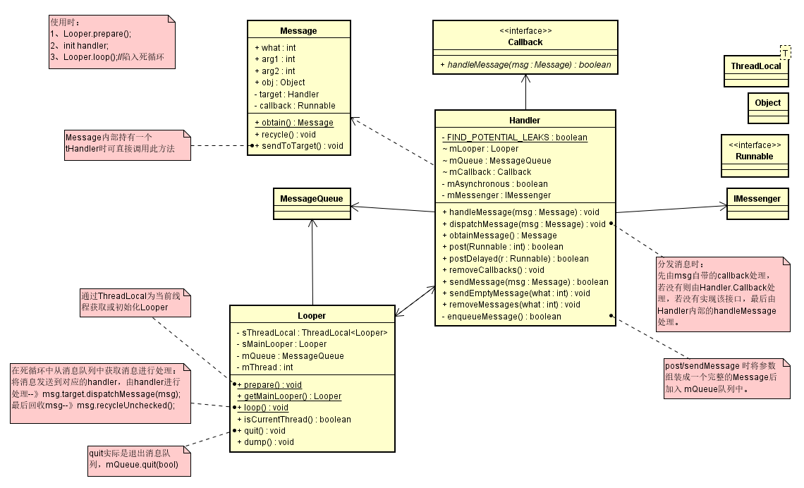

## Handler消息传递流程分析

UML类图
<br><br>
 整个请求流程中涉及到的主要类如上图。

* 基本使用步骤：
    >1. Looper.prepare();
    >2. init handler; 
    >3. Looper.loop();//陷入死循环

* 准备阶段：<br>
    Looper.prepare();
    
    通过ThreadLocal为当前线程获取或初始化Looper
    
* 消息分发：<br>
    Looper.loop();
    
    在死循环中从消息队列中获取消息进行处理：<br>
    将消息发送到对应的handler，由handler进行处理 -->
    `msg.target.dispatchMessage(msg);`
        最后回收msg --> `msg.recycleUnchecked();`
        
* 发送消息：<br>
    post/sendMessage 时将参数组装成一个完整的Message后加入 mQueue队列中。
    
* 消息处理：<br>
    由Looper分发消息至Handler：
        先由msg自带的callback处理，若没有则由Handler.Callback处理，若没有实现该接口，
        最后由Handler内部的handleMessage处理。        
    ```
    public void dispatchMessage(Message msg) {
        if (msg.callback != null) {
            handleCallback(msg);
            } else {
                if (mCallback != null) {
                    if (mCallback.handleMessage(msg)) {
                        return;
                    }
                }
            handleMessage(msg);
        }
    }
    ```