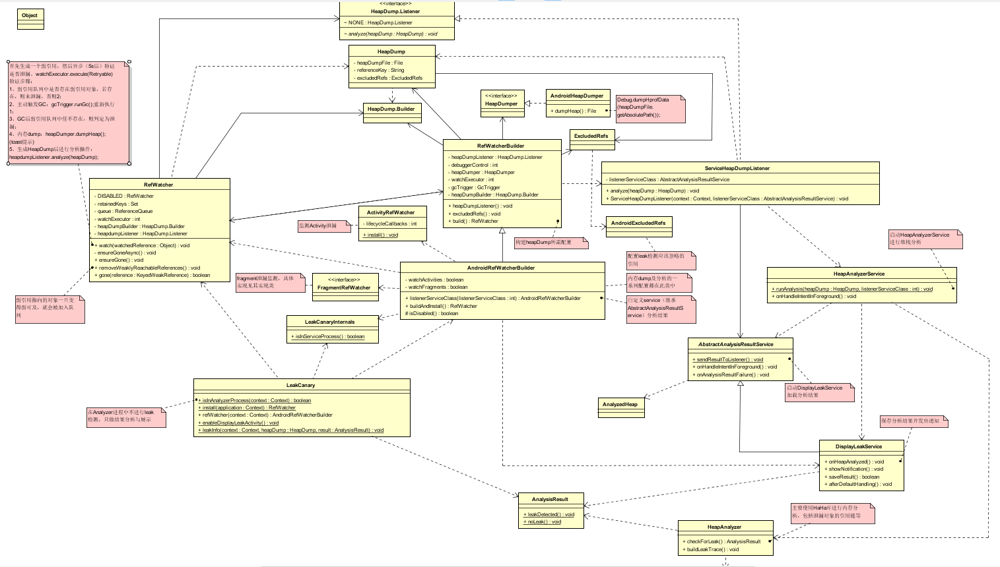

## 内存泄漏流程分析

UML类图
  
 整个请求流程中涉及到的主要类如上图。
 
* 配置： 
    使用AndroidRefWatcherBuilder配置，生成RefWatcher；
    包括内存dump及分析的一系列配置、监测Activity泄漏、fragment泄漏监测、
    自定义service（继承AbstractAnalysisResultService）分析结果；
    
* 引用内存泄漏分析过程： 
    在refWatcher.watch()中，首先生成一个弱引用，然后异步（5s后）验证是否泄漏。watchExecutor.execute(Retryable)
    验证步骤：
    1. 弱引用队列中是否存在弱引用对象，若存在，则未泄漏，否则2；
    2. 主动触发GC：gcTrigger.runGc();重新执行1；
    3. GC后弱引用队列中任不存在，则判定为泄漏，4；
    4. 内存dump：heapDumper.dumpHeap();(toast提示)
    5. 生成HeapDump后进行分析操作：heapdumpListener.analyze(heapDump);
    6. 启动HeapAnalyzerService进行堆栈分析：HeapAnalyzerService.runAnalysis(...);
    7. 启动DisplayLeakService保存分析结果并发出通知：AbstractAnalysisResultService.sendResultToListener()；

    WeakReference、ReferenceQueue，构造WeakReference时将ReferenceQueue传入，在弱引用指向的对象弱可及（对象的强引用断开，弱引用还存在？）就会被加入引用队列
    ReferenceQueue.poll，轮询队列，若有对象不为null，则认为该对象已经被GC回收，并返回该对象，然后从watchedObjects（HashMap）中移除
    弱引用指向的对象一旦变得弱可及，就会被加入队列，根据队列中是否存在引用可判断是否泄漏；
    在7中使用HeapAnalyzer进行具体分析，主要使用HaHa库进行内存分析，包括泄漏对象的引用链等。