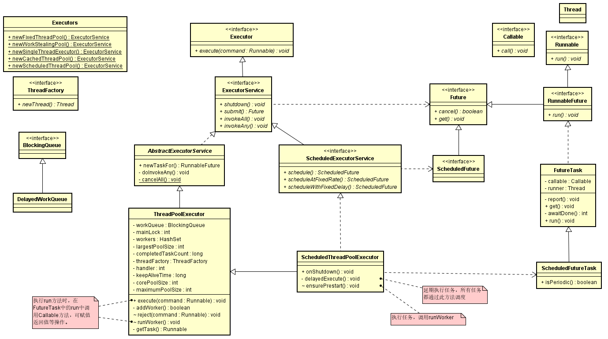

## 线程池源码分析

[参考文章](https://blog.csdn.net/programmer_at/article/details/79799267)

UML类图
<br><br>
 整个请求流程中涉及到的主要类如上图。
 
* 工作原理<br>
    当一个任务提交至线程池之后， 
    1. 线程池首先判断核心线程池里的线程是否已经满了。如果不是，则创建一个新的工作线程来执行任务。否则进入2. 
    2. 判断工作队列是否已经满了，倘若还没有满，将线程放入工作队列。否则进入3. 
    3. 判断线程池里的线程是否都在执行任务。如果不是，则创建一个新的工作线程来执行。如果线程池满了，则交给饱和策略来处理任务。
  
* 任务执行：<br>
      execute –> addWorker –>runworker （getTask） 
      
      线程池的工作线程通过Woker类实现，在ReentrantLock锁的保证下，把Woker实例插入到HashSet后，并启动Woker中的线程。 
      从Woker类的构造方法实现可以发现：线程工厂在创建线程thread时，将Woker实例本身this作为参数传入，当执行start方法启动线程thread时，本质是执行了Worker的runWorker方法。 
      firstTask执行完成之后，通过getTask方法从阻塞队列中获取等待的任务，如果队列中没有任务，getTask方法会被阻塞并挂起，不会占用cpu资源；
    
    * ThreadPoolExecutor执行execute()流程： <br>
        当一个任务提交至线程池之后， 
        1. 线程池首先当前运行的线程数量是否少于corePoolSize。如果是，则创建一个新的工作线程来执行任务。如果都在执行任务，则进入2. 
        2. 判断BlockingQueue是否已经满了，倘若还没有满，则将线程放入BlockingQueue。否则进入3. 
        3. 如果创建一个新的工作线程将使当前运行的线程数量超过maximumPoolSize，则交给RejectedExecutionHandler来处理任务。
    
        当ThreadPoolExecutor创建新线程时，通过CAS来更新线程池的状态ctl。
        ```
        int c = ctl.get();
        //如果线程池当前线程数小于corePoolSize，执行addWorker新建线程执行任务；
        if (workerCountOf(c) < corePoolSize) {
            if (addWorker(command, true))
                return;
            c = ctl.get();
        }
        //若线程池线程数大于corePoolSize，将command添加到工作队列中；
        if (isRunning(c) && workQueue.offer(command)) {
            int recheck = ctl.get();
            //双重检查，若线程池已关闭，回滚添加操作，执行拒绝方法；
            if (! isRunning(recheck) && remove(command))
                reject(command);
            //线程池处于running状态，但是没有线程？创建线程执行工作队列中的任务；
            else if (workerCountOf(recheck) == 0)
                addWorker(null, false);
        }
        //向工作队列中添加任务失败（队列已满？），则创建新线程执行任务；
        else if (!addWorker(command, false))
            reject(command);
        ```
        
    * addWorker执行流程：<br>
    ```
    private boolean addWorker(Runnable firstTask, boolean core) {
        retry:
        for (;;) {
            //各种状态检查；
            ...
            for (;;) {
                ...
                //跳出死循环
                if (compareAndIncrementWorkerCount(c))
                    break retry;
                ...
                }     
        }
       ...
        try {
        //new Worker, 内部新建一个线程
        w = new Worker(firstTask);
        final Thread t = w.thread;
        if (t != null) {
            ...
            if (workerAdded) {
                //启动线程
                t.start();
                workerStarted = true;
            }
        ...
        return workerStarted;
    }
    ```
    
    * new Worker()创建的线程实际执行的是runWorker方法：<br>
    此方法实际是在线程池中的线程中执行的。
    ```
     final void runWorker(Worker w) {
        Runnable task = w.firstTask;
        ...
        //task是第一次启动线程时传入的，getTask从工作队列（workQueue）中获取任务执行（当前工作线程中）；
        while (task != null || (task = getTask()) != null) {
        ...
        beforeExecute(wt, task);
        ...
        //执行任务
        task.run();
        ...
        afterExecute(task, thrown);
        ...
        processWorkerExit(w, completedAbruptly);
        }
     }
    ```
    
    * 线程回收等操作，getTask：<br>
    同runWorker，此方法也是在线程池中的线程中执行的。
    ```
     private Runnable getTask() {
        boolean timedOut = false; // Did the last poll() time out?
        for (;;) {
            ...
            //是否回收线程标识
            //Are workers subject to culling?
            boolean timed = allowCoreThreadTimeOut || wc > corePoolSize;
            ...
            try {
                //timed为true，即允许回收core线程或者线程数量多于core线程数；
                //timed为false时，调用workQueue.take()，若队列中无任务时线程陷入阻塞，直到有任务加入时再唤醒；
                //timed为true时，调用workQueue.poll(),在keepAliveTime时间后任无任务加入则回收线程；
                Runnable r = timed ?
                    workQueue.poll(keepAliveTime, TimeUnit.NANOSECONDS) :
                    workQueue.take();
                if (r != null)
                    return r;
                timedOut = true;
            } catch (InterruptedException retry) {
                timedOut = false;
            }
        }
     }
    ```
    
* 配置线程池需要考虑的因素<br>
  从任务的优先级，任务的执行时间长短，任务的性质（CPU密集/ IO密集），任务的依赖关系这四个角度来分析。
  并且近可能地使用有界的工作队列。
  
  性质不同的任务可用使用不同规模的线程池分开处理： 
  - CPU密集型：尽可能少的线程，Ncpu+1 
  - IO密集型：尽可能多的线程, Ncpu*2，比如数据库连接池 
  - 混合型：CPU密集型的任务与IO密集型任务的执行时间差别较小，拆分为两个线程池；否则没有必要拆分。
  
* 监控线程池的状态<br>
  可以使用ThreadPoolExecutor以下方法： 
  - getTaskCount() Returns the approximate total number of tasks that have ever been scheduled for execution. 
  - getCompletedTaskCount() Returns the approximate total number of tasks that have completed execution. 返回结果少于getTaskCount()。 
  - getLargestPoolSize() Returns the largest number of threads that have ever simultaneously been in the pool. 返回结果小于等于maximumPoolSize 
  - getPoolSize() Returns the current number of threads in the pool. 
  - getActiveCount() Returns the approximate number of threads that are actively executing tasks.
  