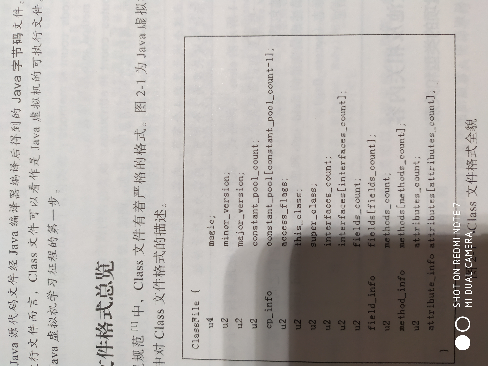
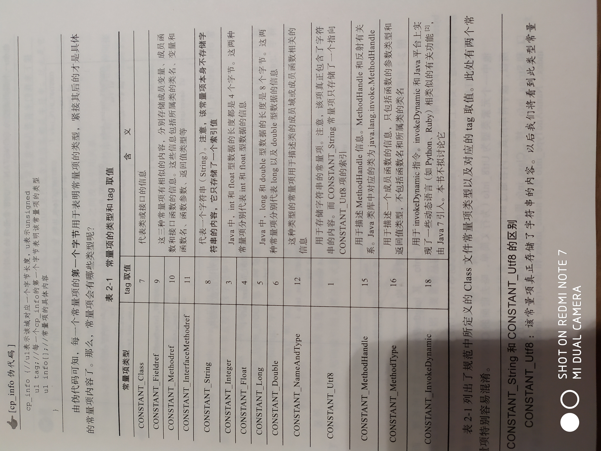
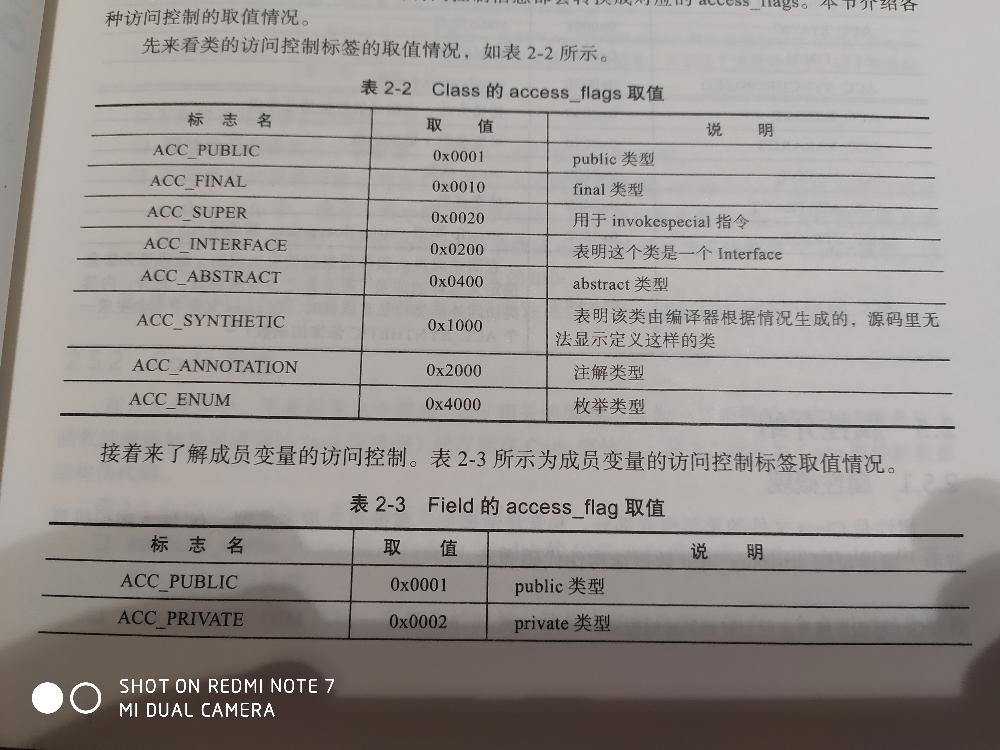
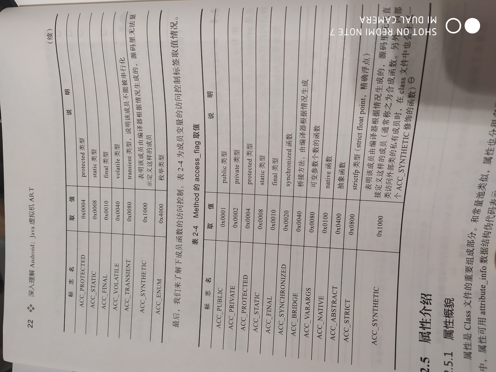
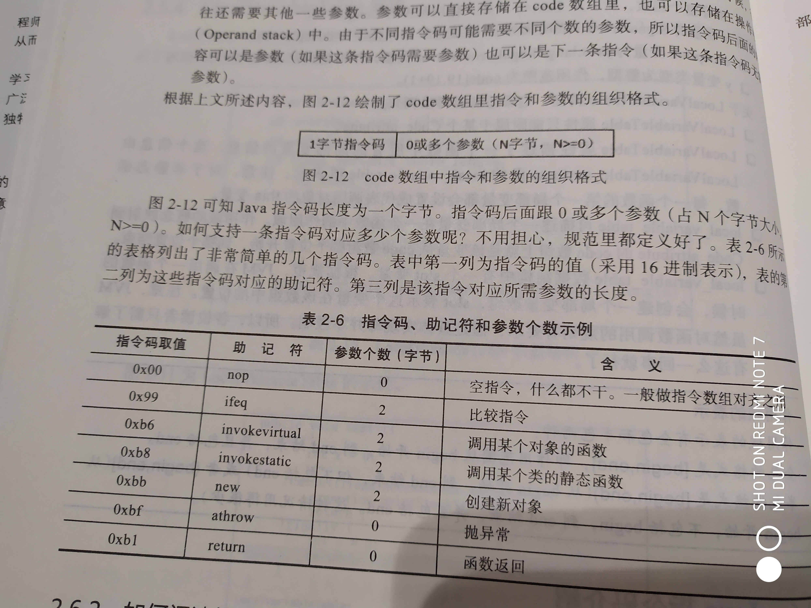

## Class 文件格式

#### 格式总览
    
    如下图：
<br><br>

    u4：表示域长度为4个字节，无符号整数
    u2：表示域长度为2个字节，无符号整数
    
    class文件前8个字节依次是：magic、minor_version、major_version
    magic：4个字节，取值必须为 0xCAFEBABE
    minor_version：2个字节，class文件版本的小版本信息
    major_version：2个字节，class文件版本的大版本信息
    
    constant_pool_count：常量池数组中的元素个数
    constant_pool：存储cp_info（cp为constant pool缩写）的数组
    每个class文件都包含一个常量池，常量池对应为数组，元素类型为cp_info，cp数组索引从1开始
    
    access_flags：类的访问权限，如：public、private等
    this_class、super_class：存储的是指向常量池数组元素的索引，
                             其对应元素为本类和父类的类名（只是类名，不包含包名）
                             
    interface_count：表示该类实现了多少个接口
    interfaces：存储接口类名的数组，实现的接口类的类名，只是常量池数组里的索引，
                真正的信息在常量池里
                
    fields_count、fields：成员变量的数量和信息，fields数组的元素为field_info结构体（表示成员变量信息）
    methods_count、methods：成员函数的数量和信息，methods数组的元素为
                            method_info结构体（表示成员函数信息）
    attributes_count、attributes：该类包含的属性数量和信息，attributes数组元素为
                                  attributes_info结构体（表示属性信息）
                                  属性信息包含：调试信息、函数对应的Java字节码、注解？？？
                                  
                                  
#### 常量池及相关内容
    
##### 常量项的类型和关系

    常量项为 cp_info：
```
    cp_info {//u1 1个字节
        u1 tag;//cp_info的第一个字节表明该常量项的类型
        u1 info[];//常量项的具体内容
    }
```
常量项类型如下图：
<br><br>

    CONSTANT_String和CONSTANT_Utf8的区别：
        CONSTANT_Utf8：该常量项真正存储字符串的内容，用一个字节数组存储
        CONSTANT_String：代表一个字符串，包含一个指向 CONSTANT_Utf8（常量池中CONTANT_Utf8_info元素） 的索引

##### 信息描述规则
    
    数据类型的描述规则：
        原始数据类型对应的字符串描述为 B C D F I J S Z 对应 byte char double float int long short boolean
        引用类型的格式为 LClassName。ClassName为对应类的全路径名，如：Ljava/lang/String;。
            . 由 / 替代，最后必须带分号。
        数组也是引用类型，格式为 [其他类型描述名，如：int[]为 [I，二维数组为 [[I
    
    成员变量的描述规则（Field Descriptor）：
        FieldDescriptor:
        FieldType    #FieldDescriptor只包含 FieldType一种信息
        FieldType:
        BaseType | ObjectType | ArrayType   #FieldType 包含三种之一
        BaseType:
        B | C | D | F | I | J | S | Z       #原始类型
        ObjectType:
        LClassName;         #引用类型
        ArrayType:          #数组类型由 [ 加 ComponentType构成
        [ ComponentType:
        ComponentType:      #ComponentType 又是由 FieldType 构成
        FieldType
        
    成员函数的描述规则（Method Descriptor）：
        包含返回值及参数的数据类型
        MethodDescriptor:
        (ParameterDescriptor*) ReturnDescriptor     #括号内是参数的数据类型，*表示可有0到多个
        ParameterDescriptor:
        FieldType
        ReturnDescriptor:
        FieldType | VoidDescriptor
        VoidDescriptor:
        V                               #V 代表 void
    eg： 函数 a(String b) --> 描述 (Ljava/lang/String;)V
    Method Descriptor 不包含函数名，为了节省空间，因为函数名不同但 Method Descriptor 一样
    
    
##### field_info、method_info


    field_info、method_info 有完全一样的成员变量
```
field_info {
    u2              access_flags; //访问标志
    u2              name_index; //指向变量名或函数名的Utf8常量项
    u2              descriptor_index;   //指向Utf8常量项，内容是 FieldDescriptor 和 MethodDescriptor
    u2              attributes_count;
    attribute_info  attributes[attributes_count];   //属性信息，域、函数都包含若干属性
}
method_info {
    u2              access_flags;
    u2              name_index;
    u2              descriptor_index;
    u2              attributes_count;
    attribute_info  attributes[attributes_count];   //代码存储在属性中
}
```

    access_flags介绍：
    类、成员变量、成员函数的访问控制取值
<br><br>
<br><br>


#### 属性介绍

##### 概貌
```
attribute_info {
    u2 attribute_name_index;    //属性名称，指向常量池中 Utf8项的索引
    u4 attribute_length;        //属性具体内容（下面）的数组长度
    u1 info[attribute_length];  //属性具体内容
}
```

    属性是由其名称来区别，名称为 attribute_name_index指向的字符串
    属性名称有：ConstantValue、 Code、 Exceptions、 SourceFile、 LocalVariableTable
    
    ConstantValue
        只出现于 field_info中，描述一个常量成员域的值（long、int、String等）
    Exceptions
        当函数抛出异常或错误（Error）时，这个函数的 method_info 将保存此属性
    SourceFile
        位于属性集合中？？包含一个指向Utf8项的索引，包含此Class对应的源码文件名
    
    Code
        函数内容（函数源码经转换后的Java字节码）存储在Code属性中
```
    Code_attribute {
        u2 attribute_name_index;    //指向内容为 Code 的Utf8_info项
        u4 attribute_length;        //内容的长度，下面的内容？
        u2 max_stack;   //说明函数执行时需要最深多少栈空间（即多少栈顶），JVM执行指令时要将指令的操作数存储在 操作数栈
        u2 max_locals;      //表示该函数包括最多几个局部变量，JVM执行函数时根据此两项分配空间
        u4 code_length;     //Java指令码长度
        u1 code[code_length];   //函数源码经编译后的Java指令码存储在 Code数组中
        u2 exception_table_length;
        //pc: program counter, JVM执行时会维护一个变量指向当前要执行的指令，这个变量就叫 PC
        { u2 start_pc;      //描述 try/catch 语句从那条指令开始，这个table 中的pc取值必须在 Code数组中
          u2 end_pc;        //表示try 语句到那条指令结束，不包括 catch
          u2 handler_pc;    //表示 catch 语句的内容从那条指令开始
          u2 catch_type;    //表示 catch 的Exception或 error 的名字，指向 Utf8项，若取值为0，表示是 final{}
        } exception_table[exception_table_length];  //一个 try/catch语句对应 exception_table数组中的一项
        u2 attributes_count;
        attribute_info attributes[attributes_count];    //其他属性
    }
```
    Code_attribute 包含的其他属性有：
        LineNumberTable，用于调试，指令对应的源码行
        LocalVariableTable，用于调试，计算本地变量的值
        LocalVariableTypeTable，功能和 LocalVariableTable 类似
        StackMapTable，JVM加载Class文件时利用此属性对函数进行类型校验
    
    LineNumberTable (只能被 Code_attribute 属性包含)
```
    LineNumberTable_attribute {
        u2 attribute_name_index;
        u4 attribute_length;
        u2 line_number_table_length;
        { u2 start_pc;
          u2 line_number;
        } line_number_table[line_number_table_length];
    }
```
    eg：line 8:0 ，表示 Code数组的第一个指令（Code[0]）来自源码第8行
    
    LocalVariableTable （描述函数中所有局部变量相关的信息，只能附属于某个 Code_attribute）
    可描述一个局部变量在函数中的作用域，即该变量在Code数组上的起始、结束位置
```
    LocalVariableTable_attribute {
        u2 attribute_name_index;
        u4 attribute_length;
        u2 local_variable_table_length;
        {   u2 start_pc;    //指令起点
            u2 length;      //指令在 Code数组中的范围
            u2 name_index;  //局部变量名字，指向 Utf8项
            u2 descriptor_index;    //局部变量类型，指向 Utf8项
            u2 index;
        } local_variable_table[local_variable_length];
    }
```

#### Java指令码
    
    Code_attribute的 Code数组只能包含两种类型信息：Java指令码和操作数
    指令码 1个字节长度，指令码个数不超过 255 个（0xFF）
    
    格式： 1字节指令码 | 0或多个参数（N字节，N>=0）
    
    更多阅读 JVM规范
    
<br><br>