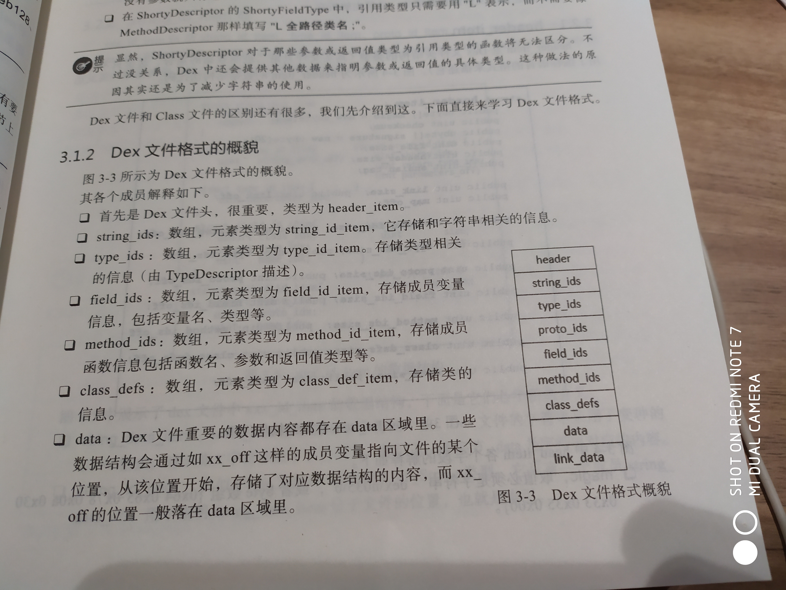
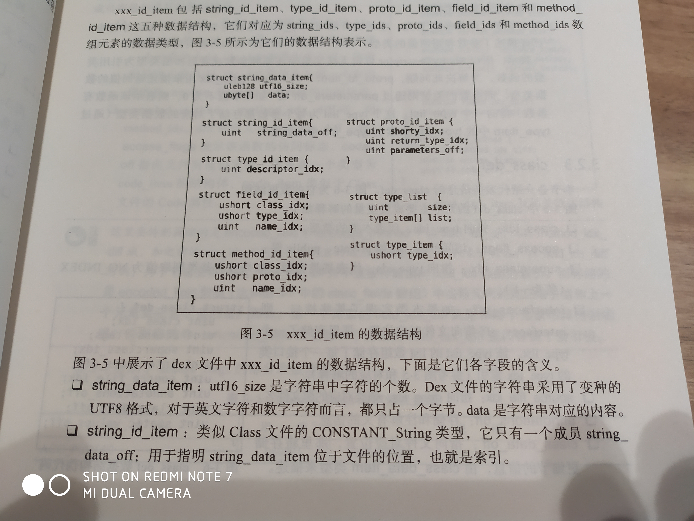
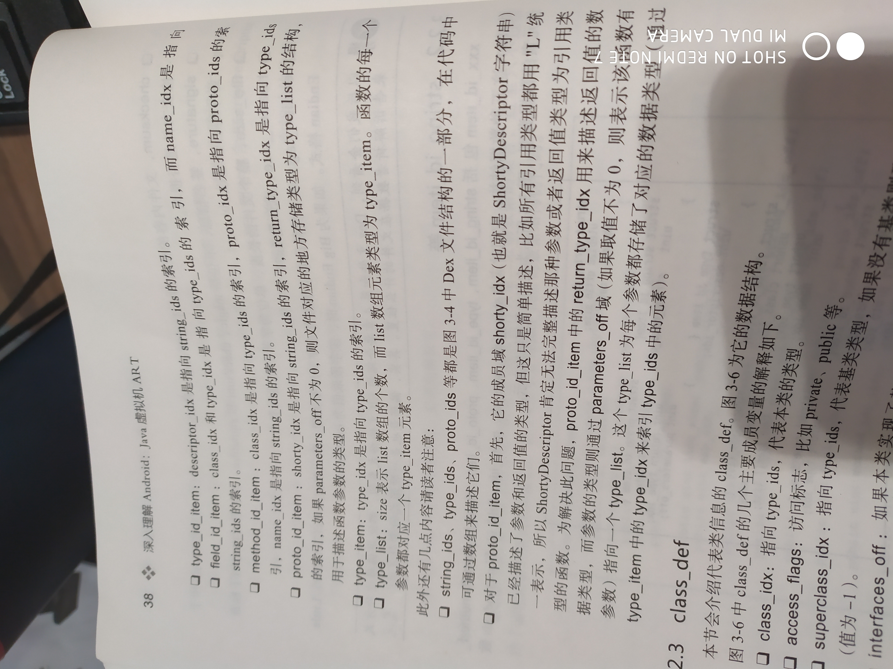
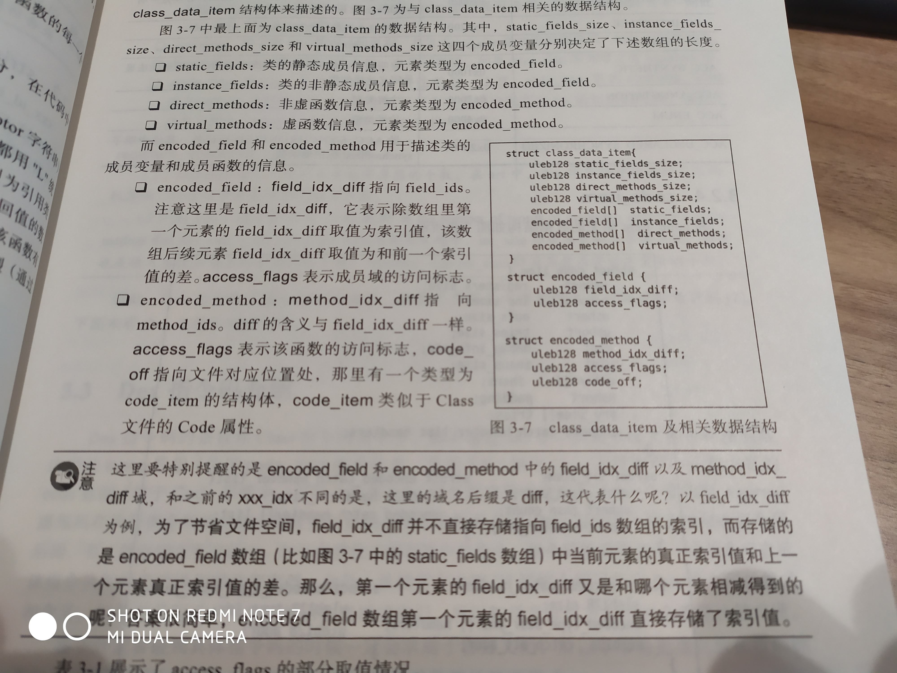
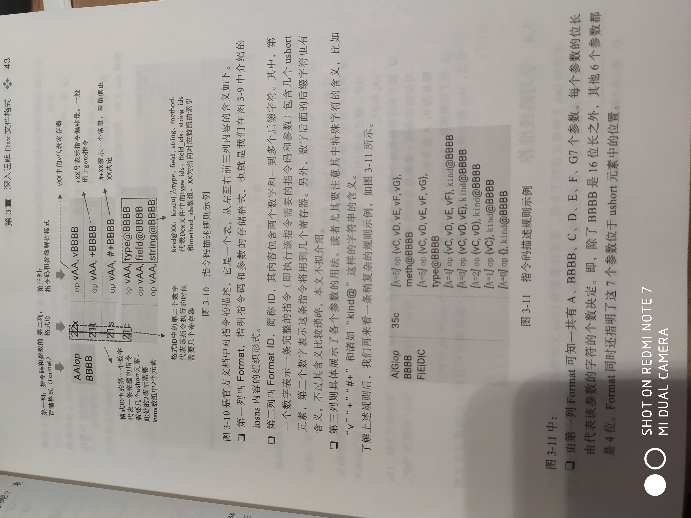
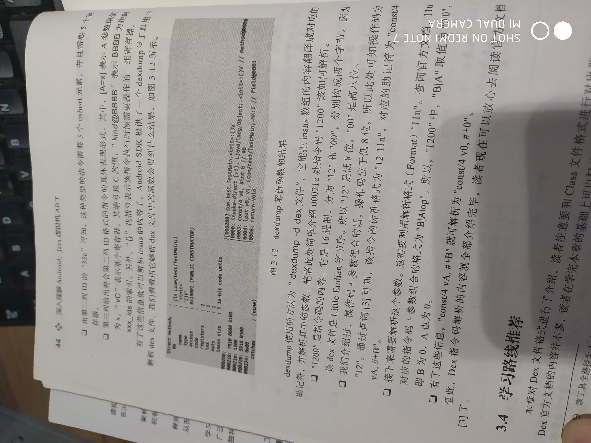

## Dex文件格式

[官方文档](https://source.android.google.cn/devices/tech/dalvik/dex-format)

#### 格式总览

    Dex、Class文件格式区别：
        一个Class文件对应一个Java源码文件，一个Dex文件对应多个Java源码文件；
        字节序不一样-- Class文件采用 Big Endian（Java）、Dex文件采用 Little Endian（Android）；
        Dex新增 LEB128数据类型（Little Endian Based 128），唯一功能是表示32比特位长度的数据（可减少空间）；
        Dex的使用信息描述规则和Class的使用规则大体类似，只在某些具体细节上略有不同        
        
    数据类型描述（Type Descriptor）：
        用字符串表示不同的数据类型，格式同Class文件
    
    简短描述（Shorty Descriptor）：
        Dex中用来描述函数的参数和返回值信息，类似Class文件的 MethodDescriptor
        
        ShortyDescriptor的描述规则：（()表示一个Group，*  表示Group可有 0 到多个）
            ShortyDescriptor -> ShortyReturnType (ShortyFieldType)*
        ShortyReturnType的描述规则：
            ShortyReturnType -> 'V' | ShortyFieldType
        ShortyFieldType的描述规则：（引用类型统一用 L 表示）
            ShortyFieldType -> Z | B | S | C | I | J | F | D | L
            

#### Dex格式概貌
    
    如下图：
<br><br>
    
    header：Dex文件头，类型为 header_item
    string_ids：数组，元素类型为 string_id_item，存储字符串相关信息
    type_ids：数组，元素类型为 type_id_item，存储类型相关信息（TypeDescriptor）
    proto_ids：数组，元素类型为 proto_id_item，描述成员函数的参数、返回值类型（包含ShortyDescriptor信息）
    field_ids：数组，元素类型为 field_id_item，存储成员变量信息，变量名、类型等
    method_ids：数组，元素类型为 method_id_item，存储成员函数信息，函数名、参数、返回值类型等
    class_defs：数组，元素类型为 class_def_item，存储类信息
    data：Dex文件重要的数据内容都在data 区域里，一些数据结构等
    link_data：预留区域，无特别作用
    
    文件头 header对解析Dex文件至关重要
    data 区域存储了绝大部分内容，data 的解析依赖于 header和相关数据项
    

##### header_item

伪代码：
```
    struct header_item {
        ubyte[] magic = new ubyte[8]; //取值必须是字符串“dex\n035\0”，或者byte数组{0x64 0x65 0x78 0x0a 0x30 0x33 0x35 0x00}
        uint checksum; //文件内容校验和，不包括 magic 和 checksum，检查文件是否损坏
        ubyte[] signature = new ubyte[20]; //签名信息，不包括 magic、checksum、signature，检查文件是否被篡改
        uint file_size; //整个文件长度，字节，包括所有内容
        uint header_size; //默认是 0x70字节
        uint endian_tag; //文件内容的字节序，默认为 0x12345678（Little Endian），Big Endian：0x78563412
        uint link_size;     uint link_off;
        ...
    }
```

##### xxx_id_item

如下图：
<br><br>
<br><br>

##### class_def

类信息的伪代码：
```
    struct class_def {
        uint class_idx;     //指向 type_ids，代表本类的类型
        uint access_flags;  //访问标志，如：private等
        uint superclass_idx;//指向 type_ids，代表基类类型，若无基类则值为 NO_INDEX -1
        uint interfaces_off;//指向文件对应位置，那里存储一个 type_list，该数组存储了每个接口的type_idx索引
        uint source_file_idx;//指向 string_ids，源文件名
        uint annotations_off;//注解有关的信息
        uint class_data_off;    //指向文件对应位置， 存储细节信息，class_data_item类型
        uint static_values_off; //存储初始化类的静态变量的值，默认为0或null， encoded_array_item
    }
```
    类的成员变量、成员函数等信息通过 class_data_off 域指向 class_data_item结构体描述
    
如下图：
<br><br>
    
##### code_item
    
数据结构伪代码：
```
    struct code_item {
        ushort registers_size;  //此函数需要用到的寄存器个数
        ushort ins_size;        //输入参数所占空间，以双字节为单位
        ushort outs_size;       //函数内部调用其他函数时，所需参数占用的空间，以双字节为单位
        ushort tries_size;      //try语句相关，为0时 不包含tries数组
        uint    debug_info_off;
        uint    insns_size;     //指令码数组长度，ushort 2个字节长度
        ushort[] insns;         //指令码内容，Dex中指令码2个字节，class中1个字节
        ushort   padding;       //将tries数组4字节对齐（前提：insns_size为奇数）
        try_item[] tries;       //描述try语句相关信息
        encoded_catch_handler_list handlers;//catch语句对应的内容
    }
```
    code_item 和 Class文件中的 Code 属性类似
    
    
#### Dex指令码

[官方文档](https://source.android.google.cn/devices/tech/dalvik/dalvik-bytecode)

    insns数组存储函数内容，Android虚拟机执行指令码时不需要操作数栈，所有参数要么直接跟在指令码后面，
    要么存储在寄存器中
    
    insns内容： [参数+操作码组合]，共2个字节，高8位参数，低8位是指令码
    
    
具体如下图：
<br><br>
<br><br>