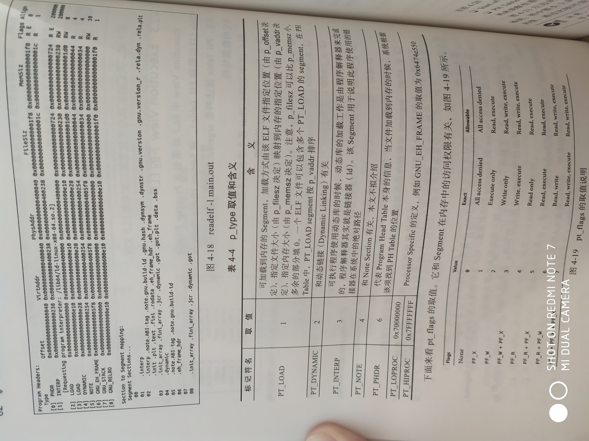
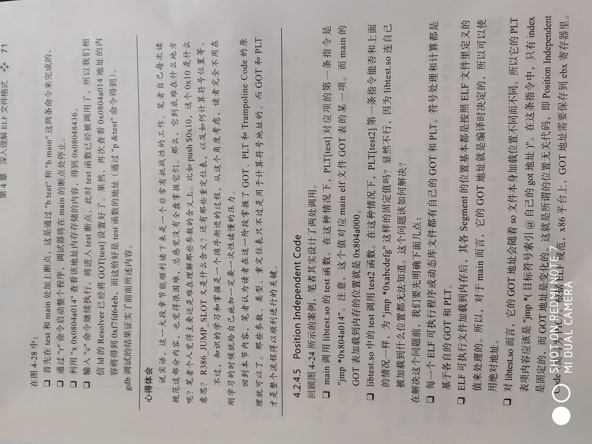

## ELF文件格式

    ELF是 Executable and Linkable Format 的缩写
    .o .obj .so 都是ELF文件
    .oat是经Android定制的ELF文件
    
    ELF文件按 Executable（可执行）、Linkable（可链接）分为两种内容：
    
    Linking View（链接视图，从编译链接的角度观察ELF文件内容，.o 文件）：
    ELF header
    Program header table optional
    Section 1
    ...
    Section n
    ...
    Section header table
    
    Executable View（执行视图，从执行的角度（可执行或动态库文件）观察ELF文件内容，.so 文件）：
    ELF header
    Program header table
    Segment 1
    Segment 2
    ...
    Section header table optional 
    
    
#### ELF文件头结构

64位平台文件头结构：
```
public class Elf64FileHeader {
    final static int EI_NIDENT = 16; //前16个字节，0-3前4个元素构成魔幻数（Magic Number），取值为 0x7f、E、L、F。EL_CLASS=4 该元素表示是 32（1） 还是 64（2） 位ELF文件
    byte[] e_ident = new byte[EI_NIDENT]; //前16个字节，EL_DATA=5 表示ELF文件数据的字节序是小端（Little Endian 1）还是大端（2 Big），EL_VERSION=6 ELF文件版本正常为1，其余为字节对齐用
    Elf64_Half e_type;      //2个字节，指明ELF文件类型
    Elf64_Half e_machine;   //2个字节，指明ELF文件对应CPU架构
    Elf64_Word e_version;   //取值同 e_ident[EL_VERSION]，1字节？
    Elf64_Addr e_entry;     //可执行程序的入口地址，是虚拟内存地址，不是实际地址
    Elf64_Off e_phoff;      //ph 为 Program header，指明 ph table在ELF文件中的起始位置（文件头的偏移量）
    Elf64_Off e_shoff;      //sh 为 Section header，指明 sh table在ELF文件中的起始位置
    Elf64_Word e_flags;     //处理器相关标识
    Elf64_Half e_ehsize;    //eh 为 ELF header，表示ELF文件头结构的长度，64位ELF文件头长度为64
    Elf64_Half e_phentsize; //指明 ph table中每个元素的长度
    Elf64_Half e_phnum;     //指明 ph table中元素个数， ph table大小为： e_phentsize X e_phnum
    Elf64_Half e_shentsize; //指明 sh table中每个元素的长度
    Elf64_Half e_shnum;     //指明 sh table中元素个数
    Elf64_Half e_shstrndx;  //每个 Section都有名字（字符串），这些字符串存储在类型为String的 section里，这个 section在 sh table中的索引就是 e_shstrndx
}
```
    Elf64_Addr 表示程序内的地址，无符号，8字节     ELF32_Addr 4字节
    Elf64_Off 表示文件偏移量，无符号，8字节       Elf32_Off 4字节
    Elf64_Half Elf32_Half 表示中等大小的整数，无符号  都是2字节， short
    Elf64_Word Elf32_Word 无符号整数，都是4字节， 等同于int

32位平台文件头结构：
```
public class Elf32FileHeader {
    final static int EI_NIDENT = 16;
    byte[] e_ident = new byte[EI_NIDENT];
    Elf32_Half e_type;
    Elf32_Half e_machine;
    Elf32_Word e_version;
    Elf32_Addr e_entry;
    Elf32_Off e_phoff;
    Elf32_Off e_shoff;
    Elf32_Word e_flags;
    Elf32_Half e_ehsize;
    Elf32_Half e_phentsize;
    Elf32_Half e_phnum;
    Elf32_Half e_shentsize;
    Elf32_Half e_shnum;
    Elf32_Half e_shstrndx;
}
```

##### e_type

    常见的e_type取值和对应说明：
        0   ET_NONE     没有类型
        1   ET_REL      REL：re-locatable，可重定位文件，如：.obj .o
        2   ET_EXEC     EXEC：Executable，代表可执行文件
        3   ET_DYN      DYN：shared object文件，如：.so
        4   ET_CORE     CORE File，gdb里的core dump 文件属于此类型
        
    OxFF00  ET_LOPROC   和具体的处理器有关，不同处理器定义的e_type取值位于
    OxFFFF  ET_HIPROC   ET_LOPROC和ET_HIPROC之间
    
##### e_machine

    表示该ELF文件适应于那种CPU平台
    
    标识符         取值      标识符说明
    EM_XXX         数字       
    EM_X86_64       62      AMD x86-64 architecture
    
##### e_flags

    因平台不同而有差异，取值和解释依赖e_machine
    ARM32位平台上 e_machine 为 EM_ARM，40，e_flags为0x02（EF_ARM_HASENTY）,表示该ELF文件包含有效e_entry值


    ABI Application Binary Interface（二进制接口），ABI和ELF紧密相关
    通用ELF文档：Tool Interface Standard(TLS) Portable Formats Specification
    通用ABI标准名叫 System V ABI
    
    可查看ELF文件内容的工具：readelf（Linux 系统工具）
    
    
### Linking View下的 ELF
    
    Linking View中包含若干 Section
    Section Header Table 描述的是Section的Header信息
    
Section Header Table 元素的数据结构
```
    typedef struct {
        Elf64_Word      sh_name;        //专门存储Section名字的Section（shstrtab），sh_name指向shstrtab的某个位置，命名：.xxx为系统预定义，自定义名称不要重名
        Elf64_Word      sh_type;        //section类型，不同类型存储不同内容，如：.shstrtab存储字符串
        Elf64_Xword     sh_flags;       //section属性
        Elf64_Addr      sh_addr;        //指明section应该加载到内存什么位置（进程的虚拟地址空间）
        Elf64_Off       sh_offset;      //表明该section真正的内容在文件什么位置
        Elf64_Xword     sh_size;        //section大小
        Elf64_Word      sh_link;
        Elf64_Word      sh_info;
        Elf64_Xword     sh_addralign;
        Elf64_Xword     sh_entsize;
    } Elf64_Shdr;
```
#### 几个Section
    
##### .shstrtab section
    
     Section Header String Table Section：
     字符串存储在 Section Header String Table 中，section名字叫 .shstrtab
     类型（sh_type）为SHT_STRTAB（值为3），SHT--Sectoin Header Type，STRTAB--String Tab
     字符串在表中按索引查找，以‘\0’作分割符
     
     工具查看： readelf -p [section名 | section索引] xxx.o
     
##### .text .bss 等 section     

        .text ：
            存储程序的指令（机器指令）
            sh_type为SHT_PROGBITS（值为1），Program Bits
            sh_flags为SHF_ALLOC（表示该section会分配内存）和SHF_EXECINSTR（该section包含可执行的机器指令）
        
        .bss ：
            block storage segment，包含一块内存区域，加载到进程空间时设置内存内容为0
            sh_type为 SHF_NOBITS（取值为8），由sh_size指定内存大小
            sh_flags取值为 SHF_ALLOC和 SHF_WRITE（内存可读写）
            int a = 0;可观察到
            
        .data ：
            与.bss类似，只是内存数据不会初始化为0，得指定具体值
            sh_type为SHF_PROGBITS
            char c = 'f'; 可观察到
            
        .rodata：
            包含只读数据信息，printf里的字符串属于这一类
            sh_flags 只能为 SHF_ALLOC
            
        objdump -S -d xxx.o; 可反编译 .text 内容
        readelf -x xxx.o; 打印section内容， .bss没有数据无法显示，其他显示值

##### .symtab
    
    存储符号表（Symbol Table）
    sh_type 为 SHT_SYMTAB
    符号表主要用于编译链接，参与动态库的加载
    （.dynsymtab（类型为SHT_DYNSYM），存储的仅是动态链接需要的符号信息）
    
符号表元素数据结构：
```
    typedef struct {
        Elf64_Word      st_name;    //符号名称，指向 .strtab section（存储.symtab符号表用到的字符串，.dynstr 存储 .dynsym符号表用到的字符串）
        unsigned char   st_info;    //符号类型和绑定属性（binding attributes）
        unsigned char   st_other;   //说明符号可见性，与st_info配合使用
        Elf64_Half      st_shndx;   //符号表中的每个元素都与其他section有关，该项就是相关section的索引号
        Elf64_Addr      st_value;   //符号的值，relocatable类型：表示符号位于相关section的具体位置；shared、Executable类型：表示该符号的虚拟内存地址
        Elf64_Xword     st_size;    //和符号相关联的数据长度
    } Elf64_Sym;
    #define ELF64_ST_BIND(info)     (info)>>4
    #define ELF64_ST_TYPE(info)     (info) & 0xf
    #define ELF64_ST_INFO(bind, type)     (bind)<<4 + (type)&0xf
```            
符号表解读如图：
<br><br>
<br><br>

##### .rel、.rela
    
    和重定位有关，重定位就是将符号的使用之处和符号的定义之处关联起来
    重定位表：
        以 .rel 开头命名： .rel.text等，跟其他section名称
        以 .rela 开头命名： .rela.text等，跟其他section名称
        两种表中元素内容细微差别
        见上图

重定位表元素数据结构：
```
    typedef struct {
        Elf64_Addr   r_offset;      //偏移量，用法与ELF类型有关
        Elf64_Xword  r_info;        //由目标项的索引号 和 重定位类型 组成 （sym和 type）
    } Elf64_Rel;
    typedef struct {
        Elf64_Addr   r_offset;
        Elf64_Xword  r_info;
        Elf64_Sxword r_addend;      //常量值，用于计算最终的重定位信息的位置
    } Elf64_Rela;
    #define ELF64_R_SYM(info)
    #define ELF64_R_TYPE(info)
    #define ELF64_R_INFO(sym, type)
```


### Execution View下的 ELF
    
    Execution View 必须包含 Program Header Table，与 Section Header Table 对应（Linking View）
    PH Table 描述的是 segment 信息
    
segment 数据结构：
```
    typedef struct {
        Elf64_Word      p_type;     //segment 类型
        Elf64_Word      p_flags;    //segment 标记符
        Elf64_Off       p_offset;   //该segment 位于文件的起始位置
        Elf64_Addr      p_vaddr;    //该segment 加载到进程虚拟内存空间时指定的内存地址
        Elf64_Addr      p_paddr;    //该segment 对应的物理地址（对于可执行文件和动态库文件该值无意义，因为系统用的是虚拟地址）
        Elf64_Xword     p_filesz;   //该segment 在文件中占据的大小，其值可为0，因为segment由section组成，而有些section不占据空间，如：.bss
        Elf64_Xword     p_memsz;    //该segment 在内存中占据的空间，其值可为0
        Elf64_Xword     p_align;    //segment 加载到内存后其首地址需要按 p_align 的要求进行对齐
    } Elf64_Phdr;
```    
    ELF文件物理上不包含 segment，segment 是一个或多个section 按一定映射关系组合而来的
    
##### p_type、p_flags    
    
具体取值如下图：
<br><br>

##### Section 到 Segment 映射
    
    区间落在 [p_offset, p_offset+p_filesz] 范围内的 Section 属于同一个 Segment
    section 与 segment 在文件上的映射完全匹配（偏移量，位置信息等）
    
    ELF文件核心内容包含在一个个 Section中，Section 类型、内部数据结构、功能等很重要
    Section 根据 PH table 的映射关系映射到进程虚拟内存空间中，这时的 Section 就是以 Segment 的样子呈现出来
    Linking View 是解析 Section，工具用 readelf
    Execution View ： Android中用 oatdump 工具解析 oat文件，将文件内容映射（mmap系统调用）到虚拟内存地址上
        遍历Segment内容，还是要借助 Section Header Table
        
        
#### 动态库加载确定绝对地址的辅助手段
        
##### .got section
    
    Global Offset Table
    表的每一项存储的是该ELF文件用到的符号（函数或变量）地址
    
##### PLT表
    
    Procedure Linkage Table
    表项存储的是一段小小的代码，触发符号地址的计算以及跳转到正确的符号地址上
    Trampoline Code
    .plt
    
GOT、PLT、Trampoline Code 是动态库加载整个流程顺利进行的关键，待重新深入了解 GOT PLT
<br><br>