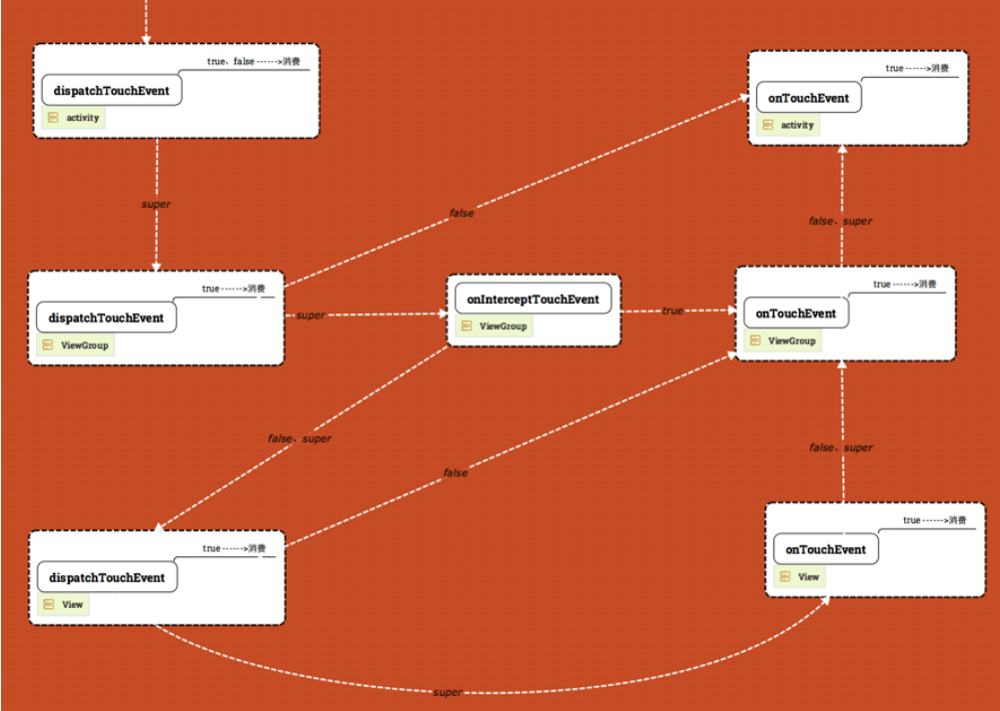
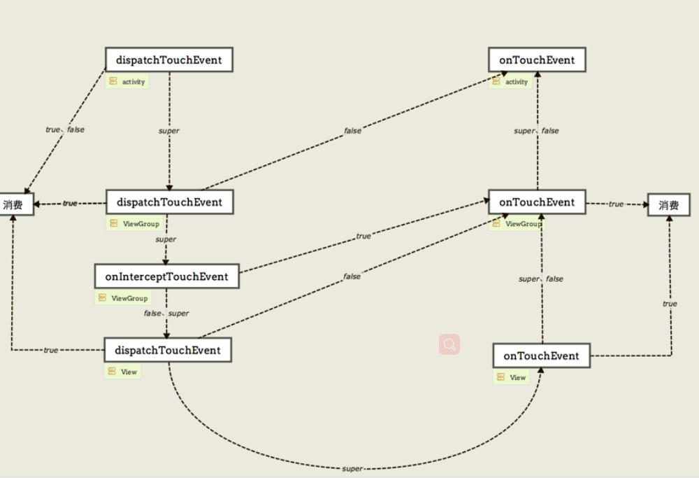

## MVVM
* 一个简单的MVVM框架
* 采用了Android Jetpack 组件（包含 LifeCycle、LiveData、ViewModel）、androidx 包
* Paging、Room、WorkManager 待接入
* 其他框架：RxJava、Retrofit、Glide 等等

##### DataBinding 双向绑定
数据源 如何封装？ 
其他基础库封装
网络相关封装

View 相关封装， List 相关封装, baseAdapter 封装
dataBinding 相关封装
事件总线 EventBus RxBus？？采用ViewModel替代Bus

View绘制流程：
     measure(子View的measure)
        |
      layout(子View的layout)
        |
       draw：
        1、 Draw the background  绘制背景
            drawBackground(canvas)
        
        2、 If necessary, save the canvas' layers to prepare for fading
        
        3、 Draw view's content  绘制View自身
            onDraw(canvas)
        
        4、 Draw children  绘制子View，如果是ViewGroup
            dispatchDraw(canvas)
        
        5、 If necessary, draw the fading edges and restore layers
        
        6、 Draw decorations (scrollbars for instance)，
        Foreground content may consist of scroll bars, 
        a {@link #setForeground foreground} drawable or other view-specific decorations. 
            绘制前景装饰 如：滚动条、setForeground(drawable)设置的内容、或其他。
            onDrawForeground(canvas)
            
        7、 draw the default focus highlight
            drawDefaultFocusHighlight(canvas)
            
事件传递流程：
 

 
   dispatchTouchEvent
       |
   onInterceptTouchEvent
       |
   onTouch(listener)
       |
   onTouchEvent
       |
   onClick...
    

